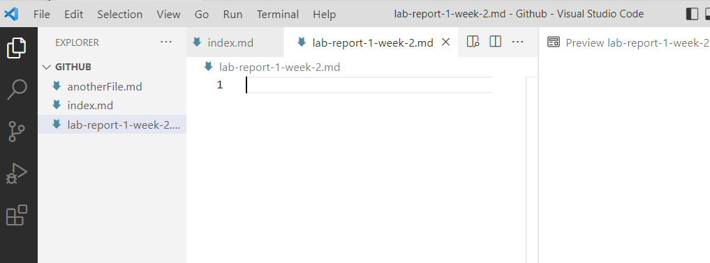
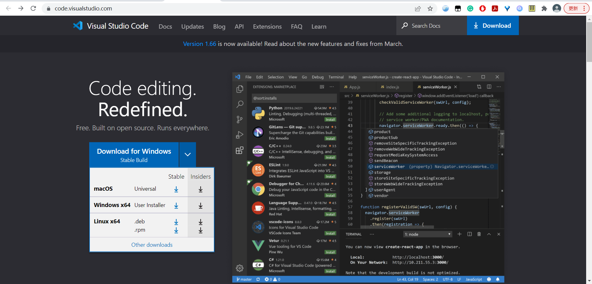
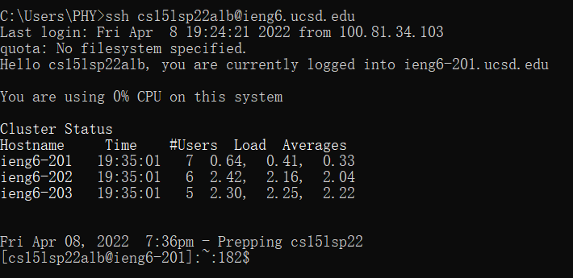
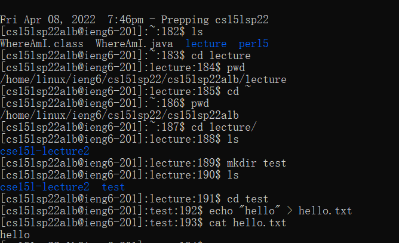
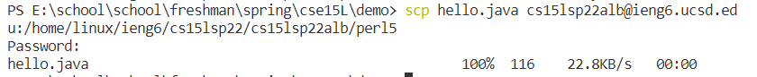
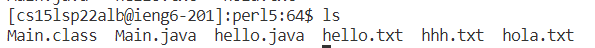
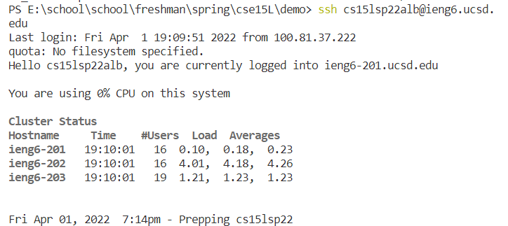
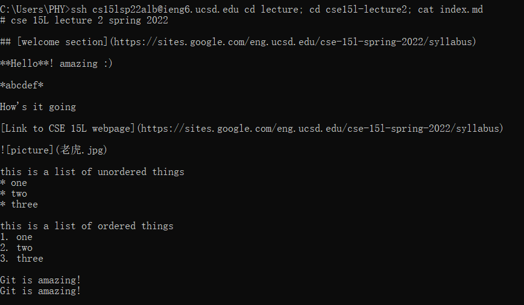

# lab report 1 wk2
## installing VScode
(Lab 1 part 2)

Download the file from website

Click the downloaded file and install VScode

## Remotely Connecting
(Lab 1 part 3)

* In lab 1, I have went through the steps about SSH keys so that I do not need to enter the password to log in([lab 1 website](https://docs.google.com/document/d/1AO6RDoJnaWxMui-UFjEa_2bbQ4qcANpbIpPuV-awsOg/edit))

* Otherwise, I need to enter the password to log in.

* Usually, we need to type `ssh USER_NAME@ieng6.ucsd.edu` and then enter our password to log in remotely.

## UNIX commands
(Lab 1 part 4)
* I use the command `ls`, `cd`, `pwd`, `mkdir`, `echo`, and `cat` here

## Moving Files with `scp` command
(Lab 1 part 5)
* we need to use `scp` command
* In the terminal, we need to run this command `scp FILE_NAME.extension USER_NAME@ieng6.ucsd.edu: path`

    * one example from lab 1 is that `scp WhereAmI.java cs15lsp22zz@ieng6.ucsd.edu:~/`
    *  
    

## Setting an SSH Key
(Lab 1 part 6)
* Use `ssh_keygen` command
* Enter the file path that I want to save the key

    * At this point, there is a private key and a public key

* Do not add a passphrase
* Copy public key to .ssh directory(use mkdir command to create .ssh) of server through `scp` command

## Optimizing remote running
* We can also run several commands at one time by separating command with semicolon.
    * 
* Use up-arrow in the terminal to get the command that we used.