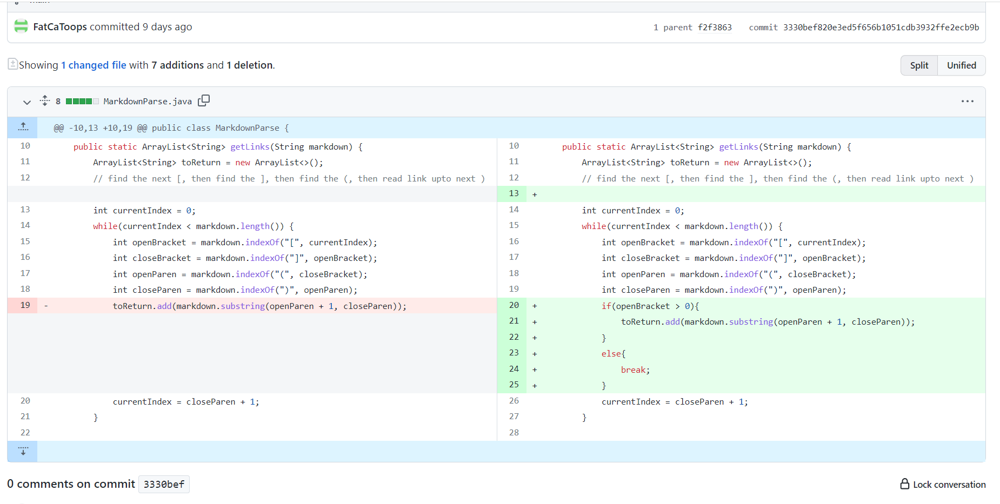
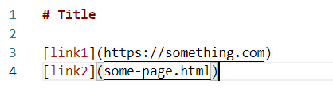
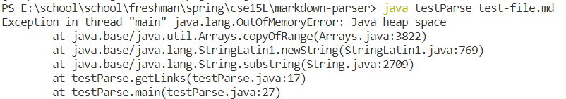
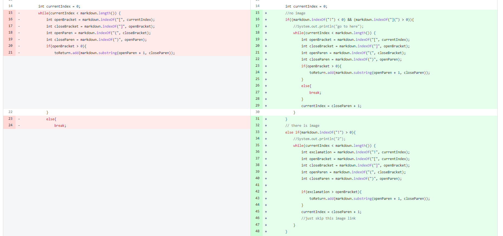
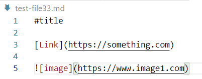
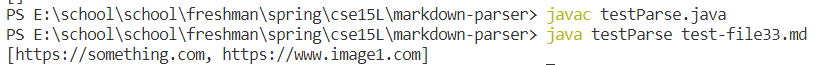
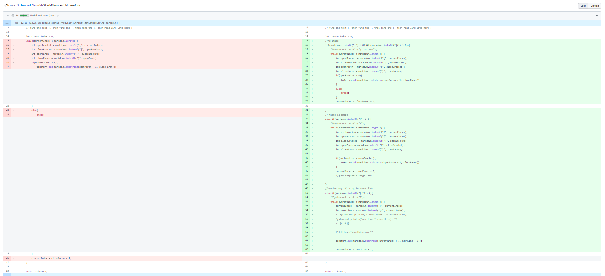
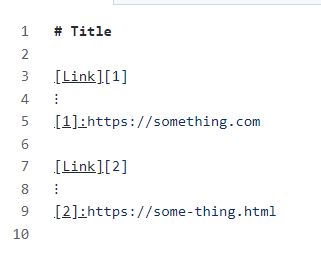
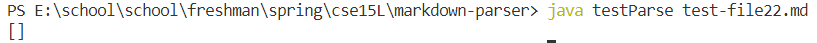

# lab report 2

* one

    

    * test file:
    
        [https://github.com/FatCaToops/markdown-parser/edit/main/test-file.md)
         

    * output:
    
        
    
    * analysis
    
        According to the output java.lang.OutOfMemoryError, it seems that there is an infinite loop when running this program. So I go back to see the input and I find that there is a new line symbol at the end of the file. Looking at the program again, the condition `currentIndex < markdown.length()` is always true.

* two

    

    * test file:
    
        [https://github.com/FatCaToops/markdown-parser/edit/main/test-file33.md) 
        

    * output:
    
        
    
    * analysis
    
        We should only include the link to the website according to the requirement of [lab 3 write-up](https://docs.google.com/document/d/1LnSfvTG_Hn2fxDtFMuhBhJqsf9336Bm1ljux2Af9FqE/edit). However, we get the wrong output for the input test-file33.md which includes the link to the image. For the original code, it cannot distinguish whether it is image link or website link because both links have open and close bracket, and open and close parenthesis.

* three

    

    * test file:
    
        [https://github.com/FatCaToops/markdown-parser/edit/main/test-file22.md) 
        

    * output:
    
        
    
    * analysis
    
        We get the wrong output. There are two ways to include the website link. Original code does not apply to another situation, so we need to add one piece of code.