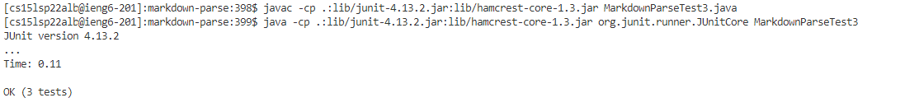

# Lab report 3

* ## Streamlining ssh configuration

    ###  Thess are the screenshots about `.ssh/config` file

     
    
    

    ###  Use `ssh` command logging into my account

     

    ###  Use `scp` command copying a file to my account using alias I choose

    

---

* ## Setup github access from ieng6

    ###  Location of public key on Github and public key and private key in my user account

    

    ###  Run `git` command to commit and push a change to Github while logged into ieng6 account

    

    

    [link to the commit](https://github.com/FatCaToops/test/commit/4aed2ba23a972867131515d9fa633f68a575ce10)

---

* ## Copy whole directories with `scp -r`

    ###  Copy markdown-parse directory to ieng6 account

    

    ###  Run the test

    

    ###  Use only one command to do `scp`, `ssh`, and runing the tests command

    If I get `error: cannot find symbol Path.of()` in the terminal, I have to remove `*.class` file in the folders and replace `javac` with `/software/CSE/oracle-java-17/jdk-17.0.1/bin/javac` and `java` with `/software/CSE/oracle-java-17/jdk-17.0.1/bin/java` 

    

    
