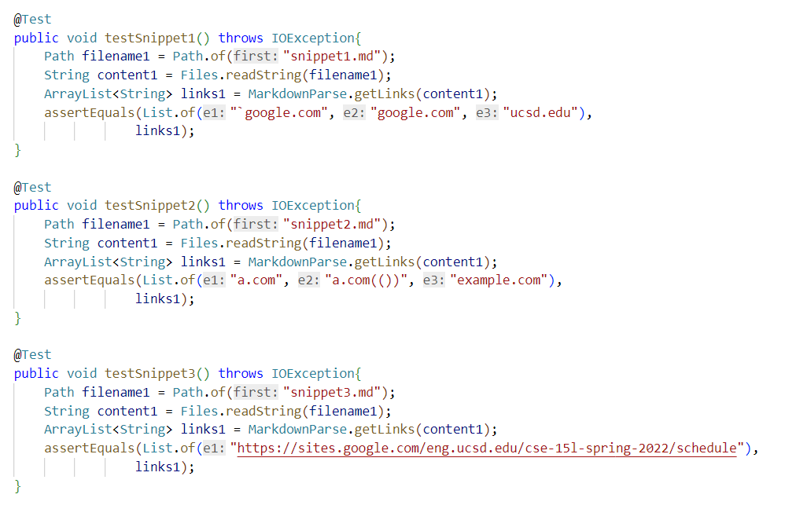
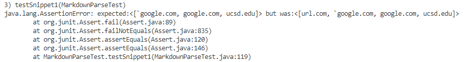
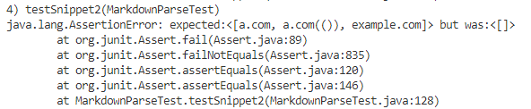
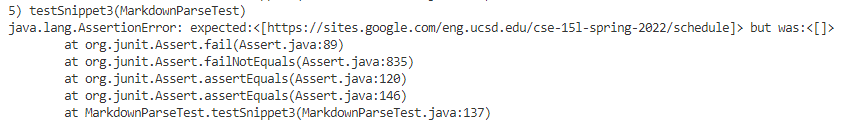

# Lab report 4

* ## Link
    [my repository](https://github.com/FatCaToops/markdown-parser)
    [another repository]()

* ## Test
    * **result**
        * test code

        

        * Snippet1.md:

            expected output:

            [`google.com, google.com, ucsd.edu]
            
        * my output:
    
            

            There can be a small code change to make my program work for snippet 1.
            
            I can add an if statement to consider the case of inline code with backticks. One way is to compare the index of two backsticks and use stack to get the right open bracket, close bracket, open parenthesis, and close parenthesis.

        * Snippet2.md:

            expected output:

            [a.com, a.com(()), example.com]

        * my output:
            
            

            Code change may be larger than 10 lines.

            To deal with the cases of nest parentheses, brackets, and esaped bracket, I need to use stack to get the right brackets and parentheses. So probably the code change is larger than 10 lines.

        * Snippet3.md:

            expected output:

            [https://sites.google.com/eng.ucsd.edu/cse-15l-spring-2022/schedule]

        * my output:
            
            

            There can be a small code change to make my program work for snippet 3.

            In this case, I believe what I need to change is to check whether there is new line symbol between brackets and parentheses by using `indexOf("\n")`, so it will be a small code change.

    
    
