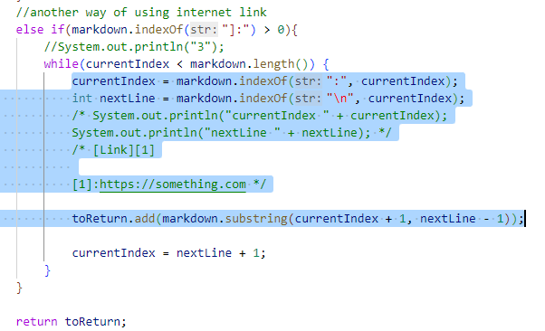

# Lab report 5

* I use `vimdiff` to find the tests with different results

## Test 1
* [14.md](https://github.com/nidhidhamnani/markdown-parser/blob/main/test-files/14.md)

* 

* Expected output should be []. There is no link in this markdown file, so both of the implementations are wrong. (Left part is my result)

* 

    In my MarkdownParse.java, there is an infinite loop in the above picture. I try to find the ":" in the file; however, there is only one ":" in the test file. Therefore, in the following loop, currentIndex is equal to -1, which leads to the infinite loop. So I have to add an if statement in the highlighted part.

## Test 2
* [12.md](https://github.com/nidhidhamnani/markdown-parser/blob/main/test-files/12.md)

* 

* Expected output should be []. There is no link in this markdown file, so my result(on the right) is wrong.

* 

    I did not consider the cases of "\" when programming. One symbol after the backslash will be printed as it is. To deal with these cases, I have to add another if statement at line 76.